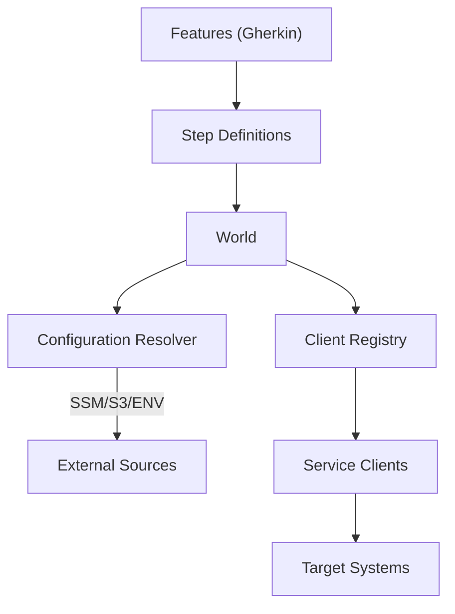

# Smoker Documentation

Welcome to the Smoker framework documentation.

- [Overview](overview.md)
- [Getting Started](getting-started.md)
- [User Guide](user-guide.md)
- [Reference](reference.md)
- [Development](development.md)

Shortcuts:
- Configuration (deep-dive): [User Guide › Configuration](user-guide.md#configuration)
- Running Locally: [User Guide › Running Locally](user-guide.md#running-locally)
- Running in AWS: [User Guide › Running in AWS](user-guide.md#running-in-aws)
- World API: [Reference › World API](reference.md#world-api)

## Architecture Overview

