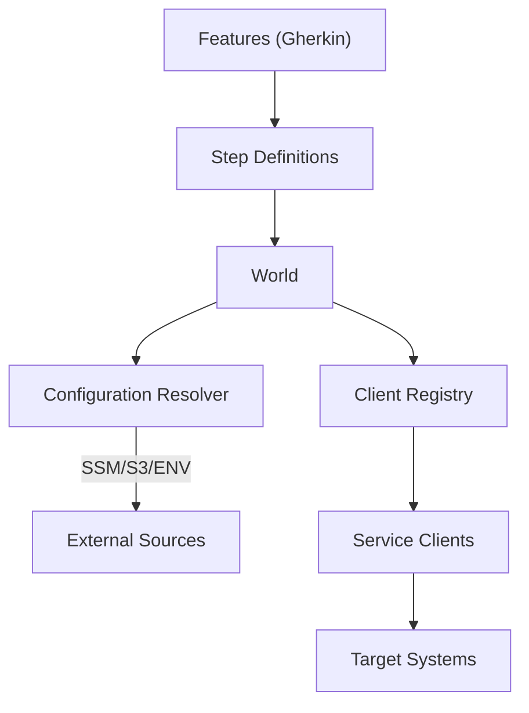

# Overview

- Back to Docs Index: [docs/index.md](index.md)
- Next: [Getting Started](getting-started.md)

## What is Smoker

Smoker is a BDD-oriented smoke testing framework for external systems, built in TypeScript with Cucumber.js and optional AWS Lambda deployment.

## Architecture



## Project Structure

```
smoker/
├── src/
│   ├── clients/
│   ├── lib/
│   ├── support/
│   ├── errors/
│   └── world/
├── features/
├── docs/
├── test/
├── cdk/
└── README.md
```

## Glossary

- World: Cucumber.js context carrying state and APIs.
- Service Client: Abstraction to external systems (REST, S3, SSM, ...).
- Configuration Resolver: Loader+merger of config sources with external references.
