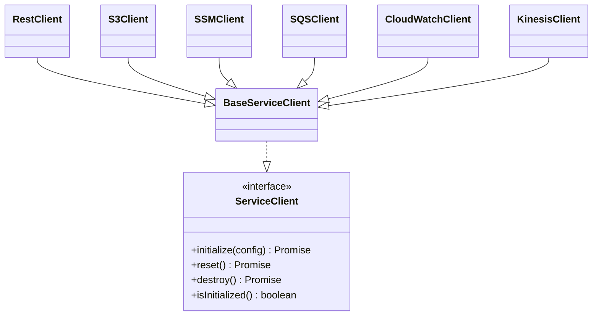

# Reference

- Back to Docs Index: [index.md](index.md)
- Related: [User Guide](user-guide.md), [Development](development.md)

## Contents

- [World API](#world-api)
- [Service Clients](#service-clients)
- [Configuration Keys](#configuration-keys)
- [Logger](#logger)
- [Errors](#errors)

## World API

Core methods:
- getConfig(path, default?)
- resolveStepParameter(ref)
- getServiceClient<T>(type, id?)
- getRest()/getS3()/getSSM()/...
- setProperty(key, value), getProperty(key)

Typical step usage:

```ts
import { Given, Then, When } from "@cucumber/cucumber";
import type { SmokeWorld } from "../src/world";

Given("I have a REST client configured for {string}", async function (this: SmokeWorld, baseUrl: string) {
  const url = await this.resolveStepParameter(baseUrl);
  await this.getRest().initialize({ baseUrl: url, timeout: 10000 });
});
```

## Service Clients

Lifecycle: `initialize()`, `reset()`, `destroy()`, `isInitialized()`.



### REST Client (example)

```json
{
  "rest": {
    "default": {
      "baseUrl": "https://api.example.com",
      "timeout": 10000,
      "retries": 3,
      "headers": { "Content-Type": "application/json" }
    }
  }
}
```

### AWS S3/SSM/SQS/CloudWatch/Kinesis

- Use least-privilege IAM.
- Use external references (SSM, S3) for secrets.

## Configuration Keys

- `cucumber.paths`, `cucumber.tags`, `cucumber.parallel`, `cucumber.timeout`, `cucumber.format[]`
- `monitoring.cloudwatch.namespace`, `monitoring.s3.bucket`, `monitoring.s3.keyPrefix`
- `clients.rest.*`, `clients.s3.*`, `clients.ssm.*`, etc.

## Logger

- Shared Pino-based logger from `src/lib/logger.ts`.
- Control via `LOG_LEVEL` (error|warn|info|debug|trace).

## Errors

- Use `SmokerError` with `code`, `domain`, `details`, `retryable`, `cause`.
- Wrap unknown errors with `SmokerError.fromUnknown(e, ctx)`.
