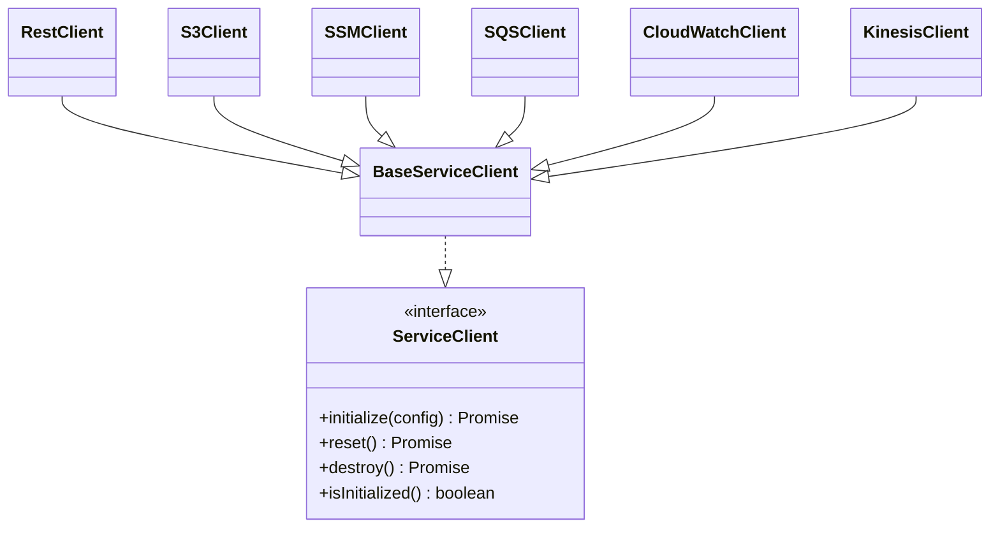

# Reference

- Back to Docs Index: [index.md](index.md)
- Related: [User Guide](user-guide.md), [Development](development.md)

## Contents

- [World API](#world-api)
- [Step Utilities](#step-utilities)
- [Service Clients](#service-clients)
- [Configuration Keys](#configuration-keys)
- [Available Steps](#available-steps)
- [Steps Reference](#steps-reference)
- [Logger](#logger)
- [Errors](#errors)

Tip: Start with World API and Step Utilities to understand step building blocks, then jump to Service Clients and Steps Reference for concrete usage.

## World API

Core methods:

- getConfig(path, default?) – async accessor with resolution
- resolveParam(ref)/resolveStepParameter(ref)
- getServiceClient<T>(type, id?) – factory-style access
- getClient<T>(name) – direct access via client key (e.g., `clientKey(ClientType.REST, id)`)
- setProperty(key, value), getProperty(key)

Typical step usage (conceptual):

```ts
Given("I have a REST client {string} configured", async function (id: string) {
  const cfg = await this.getConfig("clients.rest.default");
  const client = this.registerClientWithConfig("rest", cfg, id);
  await client.init();
});

When("I send a GET to {string}", async function (path: string) {
  const client = this.getServiceClient("rest");
  const url = await this.resolveParam(path);
  const resp = await client.get(url);
  this.setProperty("rest:lastStatus", resp.status);
});
```

## Step Utilities

Helpers available from `src/lib/step-utils.ts` and used across steps:

- `tableToRecord(table)`: two-column DataTable → `{[k]: v}`.
- `parseJsonDoc(doc)`: JSON if valid; raw string otherwise; undefined when empty.
- `coercePrimitive(value)`: "true" → true, "42" → 42, "null" → null, etc.
- `resolveDeepWithWorld(world, input)`: deep resolve of strings/arrays/objects using `world.resolveParam` with coercion.
- `normalizeHeaders(headers)`: case-insensitive map; arrays joined.
- `parseDurationMs(str)`: e.g., "2s" → 2000; throws on invalid formats.
- `waitFor(predicate, { timeoutMs, intervalMs })`: polling until predicate true or timeout.
- `resolveAndBuildUrl(world, base, path, query?)`: resolve parts and build final URL with query.
- `ObjectUtils.deepGet(obj, path)`: supports dot and bracket notation (e.g., `user.credentials[0].key`, `data['some.key']`).
- `ObjectUtils.deepSet(obj, path, value)`: sets value at dot/bracket path, creating objects/arrays as needed.

## Service Clients

Lifecycle: `initialize()/init()`, `reset()`, `destroy()`, `isInitialized()`.



### REST Client (example)

```json
{
  "rest": {
    "default": {
      "baseUrl": "https://api.example.com",
      "timeout": 10000,
      "retries": 3,
      "headers": { "Content-Type": "application/json" }
    }
  }
}
```

### AWS S3/SSM/SQS/CloudWatch/Kinesis

- Use least-privilege IAM.
- Use external references (SSM, S3) for secrets.

## Configuration Keys

Merge priority: Defaults < local JSON < S3 JSON < programmatic < ENV < CLI. See [User Guide › Configuration](user-guide.md#configuration).

Common keys (illustrative):

- `cucumber.paths[]`, `cucumber.tags`, `cucumber.parallel`, `cucumber.timeout`, `cucumber.format[]`
- `clients.rest.default.{baseUrl, timeout, headers, retries}`
- `clients.s3.default.{region, bucket}`
- `clients.ssm.default.{region, withDecryption}`
- `clients.sqs.default.{region, queueUrl}`
- `clients.cloudwatch.default.{namespace, dimensions[]}`
- `monitoring.cloudwatch.{namespace, dimensions[]}`
- `monitoring.s3.{bucket, keyPrefix}`

## Available Steps

Step definition files under `features/step_definitions/`:

- `rest.steps.ts` – HTTP methods, base/path/query headers, body, status/body/header assertions.
- `mqtt.steps.ts` – MQTT publish/subscribe interactions.
- `kafka.steps.ts` – Kafka topic produce/consume flows.
- `aws-s3.steps.ts` – S3 get/put/list operations.
- `aws-ssm.steps.ts` – Parameter Store get/put (with decryption).
- `aws-sqs.steps.ts` – SQS send/receive/delete messages.
- `aws-cloudwatch.steps.ts` – Metrics publishing and assertions.
- `aws-kinesis.steps.ts` – Kinesis put/consume records.

See also the [User Guide](user-guide.md) for end-to-end examples.

## Steps Reference

### Resolution Rules

- **Single parameters**: resolved via `resolveDeepWithWorld()` (supports `config:`, `property:`, `ssm://`, etc.).
- **Tables**: parsed using `tableToRecord()` then resolved via `resolveDeepWithWorld()`; REST headers are normalized with `normalizeHeaders()`.
- **Doc strings / bodies**: parsed with `parseJsonDoc()` then deeply resolved with `resolveDeepWithWorld()`; keys remain unchanged.
- **Durations**: human-friendly strings parsed with `parseDurationMs()` (e.g., `"500ms"`, `"2s"`, `"1m"`, `"3h"`, or `"150"`).

### Duration-String Waits

Where steps accept timeouts, `{string}` variants parse human-friendly durations. Examples:

```
When I wait up to "2s" for MQTT client {string} to receive a message on {string}
When I wait up to "1m" for Kafka client {string} to receive a message on topic {string} containing {string}
When I wait up to "500ms" with CloudWatch client {string} for pattern {string} in stream {string}
```

### REST

```
Given a REST client {string} configured as:
When I send a {word} request with REST client {string} base {string} path {string}
When I send a {word} request with REST client {string} base {string} path {string} with query:
When I send a {word} request with REST client {string} base {string} path {string} with headers and query:
When I send a {word} request with REST client {string} base {string} path {string} with headers, query and body:
When I send a {word} request with REST client {string} to {string}
When I send a {word} request with REST client {string} to {string} with headers:
When I send a {word} request with REST client {string} to {string} with body:
When I send a {word} request with REST client {string} to {string} with headers and body:
Then the REST response status should be {int}
Then the REST response body should contain {string}
Then the REST response header {string} should be {string}
```

Notes:

- URLs are built with `resolveAndBuildUrl(world, base, path, query?)`.
- Headers tables are normalized and values resolved.
- Query values are resolved; object values are JSON-stringified.
- Bodies are parsed and resolved deeply; keys unchanged.

### Kafka

```
Given a Kafka client {string} configured as:
When I subscribe Kafka client {string} to topics {string} with group {string}
When I send a Kafka message with client {string} to topic {string} with body {string}
When I wait up to {int} ms for Kafka client {string} to receive a message on topic {string} containing {string}
When I wait up to {string} for Kafka client {string} to receive a message on topic {string} containing {string}
Then the last Kafka send should return a partition number
Then the last Kafka message should exist and contain {string}
```

### MQTT

```
Given an MQTT client {string} configured as:
When I subscribe MQTT client {string} to topic {string}
When I unsubscribe MQTT client {string} from topic {string}
When I publish with MQTT client {string} to topic {string} the message:
When I wait up to {int} ms for MQTT client {string} to receive a message on {string}
When I wait up to {string} for MQTT client {string} to receive a message on {string}
Then the last MQTT message should contain {string}
```

### S3

```
Given an S3 client {string} configured as:
When I write to S3 with client {string} key {string} the content:
When I write JSON to S3 with client {string} key {string} the object:
When I read from S3 with client {string} key {string}
When I delete from S3 with client {string} key {string}
Then the last S3 content should contain {string}
```

### SSM

```
Given an SSM client {string} configured as:
When I write SSM parameter with client {string} name {string} value {string} type {string} overwrite {string}
When I read SSM parameter with client {string} name {string} with decryption {string}
When I delete SSM parameter with client {string} name {string}
Then the last SSM value should be {string}
```

### SQS

```
Given an SQS client {string} configured as:
When I send to SQS with client {string} the body {string}
When I receive up to {int} SQS messages with client {string} waiting {int} seconds
When I delete the last received SQS message with client {string}
When I purge the SQS queue with client {string}
Then the last SQS receive should return at least {int} messages
Then the last SQS message body should contain {string}
```

### CloudWatch

```
Given a CloudWatch client {string} configured as:
When I list CloudWatch log streams with client {string}
When I get CloudWatch log events with client {string} from stream {string} between {int} and {int} limiting {int}
When I search CloudWatch with client {string} on stream {string} for pattern {string} between {int} and {int}
When I wait up to {int} ms with CloudWatch client {string} for pattern {string} in stream {string}
When I wait up to {string} with CloudWatch client {string} for pattern {string} in stream {string}
When I publish a CloudWatch metric with client {string} as:
When I publish CloudWatch metrics with client {string} list:
Then the last CloudWatch search should return at least {int} matches
Then CloudWatch should have found the pattern
Then the last CloudWatch events should be at least {int}
```

### Kinesis

```
Given a Kinesis client {string} configured as:
When I list Kinesis shards with client {string}
When I put a Kinesis record with client {string} partition key {string} and data:
When I get Kinesis shard iterator with client {string} for shard {string} type {string} sequence {string}
When I get up to {int} Kinesis records with client {string} using the last iterator
When I wait up to {int} ms for Kinesis client {string} to get records with partition key {string}
When I wait up to {string} for Kinesis client {string} to get records with partition key {string}
Then the last Kinesis records should be at least {int}
Then one of the last Kinesis records should contain {string}
```

### Properties

```
When I store value {string} into property {string}
When property {string} receives {string} from {string}
Then property {string} should equal {string}
Then property {string} should be bigger than {string}
Then property {string} should be less than {string}
Then property {string} should contain {string}
Then property {string} should match regex {string}
Then property {string} should exist
Then property {string} should be defined
```

Note: Nested path extraction is supported using dot/bracket notation (e.g., `user.credentials[0].key`, `data['some.key']`). See `ObjectUtils.deepGet()` in Step Utilities.

## Logger

- Shared Pino-based logger from `src/lib/logger.ts`.
- Control via `LOG_LEVEL` (error|warn|info|debug|trace).

## Errors

- Use `SmokerError` with `code`, `domain`, `details`, `retryable`, `cause`.
- Wrap unknown errors with `SmokerError.fromUnknown(e, ctx)`.
