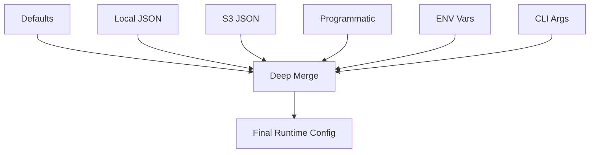
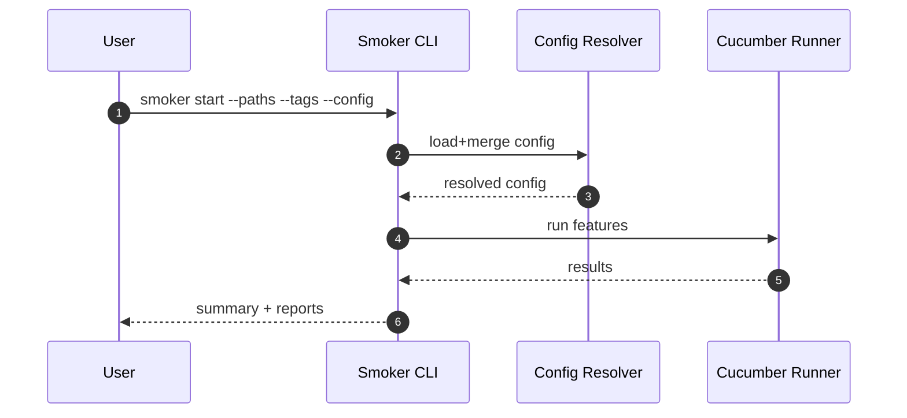
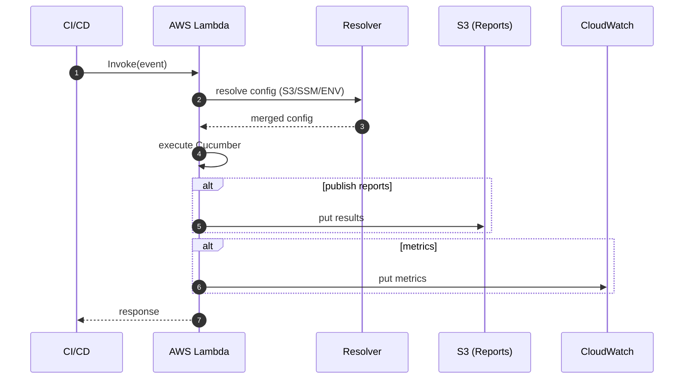

# User Guide

- Back to Docs Index: [index.md](index.md)
- Related: [Overview](overview.md), [Reference](reference.md)

## Contents

- [Configuration](#configuration)
- [Running Locally](#running-locally)
- [Running in AWS](#running-in-aws)
- [Reporting & Monitoring](#reporting--monitoring)

## Configuration

Sources supported: Defaults, Local JSON, S3 JSON, Programmatic, Environment variables, CLI.



- External references: `ssm:/path`, `s3://bucket/key`, `config:path.to.value`, `property:name`.
- Deletion with `null` to remove keys.

Examples and details are consolidated from: `usage/configuration.md`.

## Running Locally

```bash
npm start -- --paths "dist/features/**/*.feature" --tags "@smoke" --logLevel debug
```

Key options: `--paths`, `--tags`, `--config`, `--timeout`, `--parallel`, `--format`.



## Running in AWS

AWS Lambda event, env var and IAM basics.



## Reporting & Monitoring

- Reports: JSON, HTML, JUnit; store locally or in S3.
- Metrics: CloudWatch custom metrics (e.g., TestsTotal, TestsPassed, TestsFailed, Duration).

For step patterns and examples, see [Getting Started](getting-started.md) and [Reference](reference.md#world-api).
